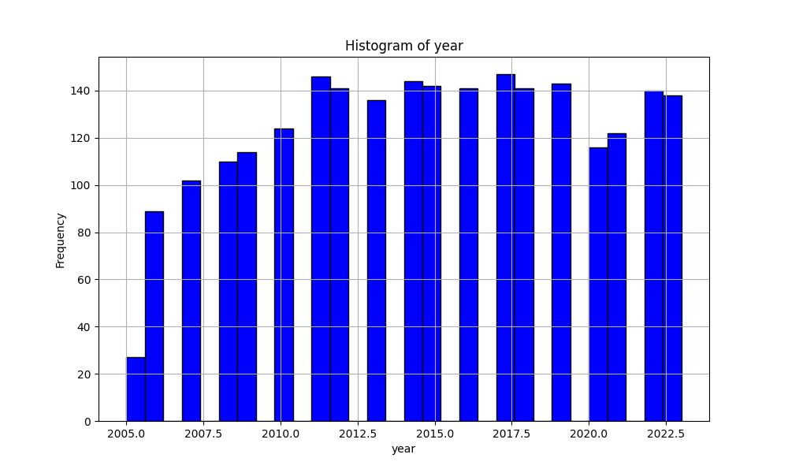

# Data Analysis Report for happiness.csv

## Summary Statistics

       Country name         year  Life Ladder  Log GDP per capita  Social support  Healthy life expectancy at birth  Freedom to make life choices   Generosity  Perceptions of corruption  Positive affect  Negative affect
count          2363  2363.000000  2363.000000         2335.000000     2350.000000                       2300.000000                   2327.000000  2282.000000                2238.000000      2339.000000      2347.000000
unique          165          NaN          NaN                 NaN             NaN                               NaN                           NaN          NaN                        NaN              NaN              NaN
top         Lebanon          NaN          NaN                 NaN             NaN                               NaN                           NaN          NaN                        NaN              NaN              NaN
freq             18          NaN          NaN                 NaN             NaN                               NaN                           NaN          NaN                        NaN              NaN              NaN
mean            NaN  2014.763860     5.483566            9.399671        0.809369                         63.401828                      0.750282     0.000098                   0.743971         0.651882         0.273151
std             NaN     5.059436     1.125522            1.152069        0.121212                          6.842644                      0.139357     0.161388                   0.184865         0.106240         0.087131
min             NaN  2005.000000     1.281000            5.527000        0.228000                          6.720000                      0.228000    -0.340000                   0.035000         0.179000         0.083000
25%             NaN  2011.000000     4.647000            8.506500        0.744000                         59.195000                      0.661000    -0.112000                   0.687000         0.572000         0.209000
50%             NaN  2015.000000     5.449000            9.503000        0.834500                         65.100000                      0.771000    -0.022000                   0.798500         0.663000         0.262000
75%             NaN  2019.000000     6.323500           10.392500        0.904000                         68.552500                      0.862000     0.093750                   0.867750         0.737000         0.326000
max             NaN  2023.000000     8.019000           11.676000        0.987000                         74.600000                      0.985000     0.700000                   0.983000         0.884000         0.705000

## Visualizations

## Generated Story
### Generated Story: The Pursuit of Happiness – A Global Tale

Imagine a world map, not marked with borders or political boundaries, but with vivid colors representing happiness, health, and prosperity. Each hue tells the story of a nation's quest to thrive, to laugh, and to endure despite the challenges life throws. As we embark on this journey, let’s explore the underlying narratives behind the numbers in this fascinating dataset.

---

### **Lebanon: The Frequent Visitor**
Our story begins with Lebanon, a country that appears most frequently in this data. But why? Lebanon’s presence might symbolize its constant struggle and resilience. Over time, this nation has danced on a tightrope, balancing between moments of despair and hope. Despite the political turmoil and economic instability, the spirit of its people shines through, proving that even in adversity, the human spirit remains unbroken.

---

### **The Rollercoaster of Life: Life Ladder Scores**
The Life Ladder—a measure of perceived happiness—has its highs and lows, from a sobering 1.28 to an inspiring 8.02. This wide range speaks to the diversity of human experiences. Somewhere in a quiet Scandinavian village, a child might be playing in a serene forest, their Life Ladder pegged near 8. Meanwhile, in a bustling city struck by conflict, someone fights for survival, their ladder barely reaching 2. And yet, it is this very contrast that binds us, reminding us of the beauty of striving for a better tomorrow.

---

### **Wealth and Well-Being: A Delicate Balance**
As the saying goes, money can’t buy happiness—but it sure helps. The dataset tells us that countries with a higher GDP per capita, soaring as high as 11.68, often report better Life Ladder scores. Yet, generosity—a purely human trait—isn’t tied to wealth. Even nations with modest means display incredible acts of kindness, teaching us that while prosperity builds comfort, compassion builds community.

---

### **The Comfort of Connection**
Social support emerges as a cornerstone of happiness, with scores reaching nearly 0.99. Picture an elderly woman in Japan receiving a hot meal from her neighbor, or a small-town farmer in Italy receiving help to rebuild after a flood. These are the invisible threads of humanity that tie us together, reminding us that life’s greatest joy often lies in the warmth of others.

---

### **The Paradox of Freedom**
Freedom to make life choices—a vital indicator—paints an intriguing picture. Some nations boast scores as high as 0.985, their people free to choose their destinies. Yet, freedom doesn’t always guarantee happiness. What if too many choices create uncertainty? What if the burden of decision dampens joy? As nations strive to maximize freedom, the challenge lies in guiding individuals toward fulfillment, not just autonomy.

---

### **Health: The Ultimate Wealth**
Healthy life expectancy at birth ranges from a mere 6.7 years in challenging environments to a promising 74.6 years in the most thriving regions. It’s a stark reminder of the world’s inequalities but also a beacon of hope. With advancements in medicine, education, and public health, even those at the lower end of the spectrum can aspire to greater longevity and vitality.

---

### **Corruption and Trust: The Silent Battle**
Perceptions of corruption tell us a tale of trust—or the lack thereof. A score near 0.035 represents a deep-seated skepticism in leadership, while a high score like 0.983 suggests a society that believes in its systems. This invisible metric wields immense power, for a nation where trust flourishes, so too does the spirit of its people.

---

### **The Light and Shadow of Emotions**
Positive and negative affects reveal the duality of human nature. While joy, laughter, and gratitude radiate from one corner of the world, worry, sadness, and anger cast shadows in another. Yet, both are essential—they are what make us human. Without sorrow, would we truly appreciate happiness? Without struggle, would triumph be as sweet?

---

### **The Big Picture**
This dataset is more than just numbers; it’s a tapestry of human life. It tells the story of nations striving to find the perfect balance between prosperity and kindness, freedom and trust, health and happiness. It reminds us that while the specifics may vary, the quest for a meaningful, joyful life is universal.

In the end, we’re all climbing the same Life Ladder. Some rungs may be higher, some steeper, but the climb itself—the connections we forge, the resilience we show, the hope we carry—is what makes the journey worthwhile. And so, the story continues, one ladder at a time.
